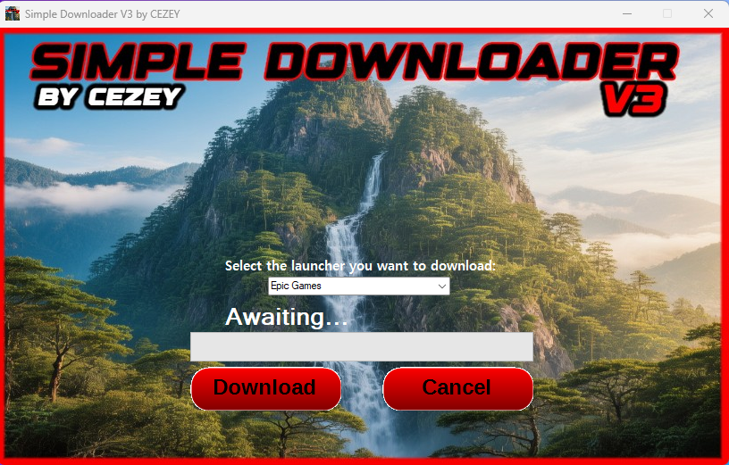

# Simple Downloader V3
This one is a launcher downloader (i gave up on launcher downloader name), and now it's the Launcher Downloader but improved.

__(This doesn't download them from somewhere in my github or other sites, it gets them exactly from the original devs site)__

## ⚙️ Features
- Can download launchers directly from they're official sources
- Dynamic links (everytime the a launcher executable gets updated, the program will pull the latest version available and downloads it to your machine)
- Fast download rates
- Select bar with the available launchers:
       - Epic Games
       - Steam
       - EA App
       - GOG Galaxy
       - Ubisoft Connect

  
